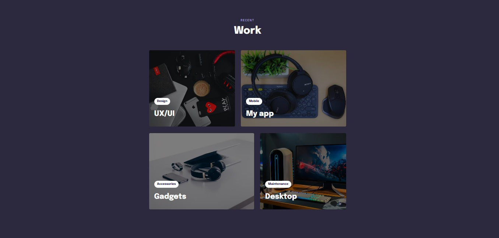

<h1 align="center"> Land 08 - English</h1>

  <a href="#-tecnologias">Technologies</a>&nbsp;&nbsp;&nbsp;|&nbsp;&nbsp;&nbsp;
  <a href="#-projeto">Project</a>&nbsp;&nbsp;&nbsp;|&nbsp;&nbsp;&nbsp;
  <a href="https://gabriel-adsv.github.io/stage03-desafio-das-toupeiras/" target="_blank">Layout</a>&nbsp;&nbsp;&nbsp;|&nbsp;&nbsp;&nbsp;
  <a href="#memo-licença">License</a>

  

Project developed at Stage 03 of the classes in the Explorer track of Rocketseat. In this challenge, CSS animation knowledge was applied. Now, the same project has been reused in Land 08 for English practice.

 

  

## 🚀 Technologies
This project was developed using the technologies:
- HTML
- CSS
- Animations with keyframes

## 💻 Project
In this project, the practices of CSS grid, animation, and keyframes were applied.

- [Access the finished project online](https://gabriel-adsv.github.io/land08-english-desafio/)

## 📧 Contact
- gabriel.aug.dsv@gmail.com

## 📝 License
This project is under the MIT license.

---
Developed by Gabriel Augusto